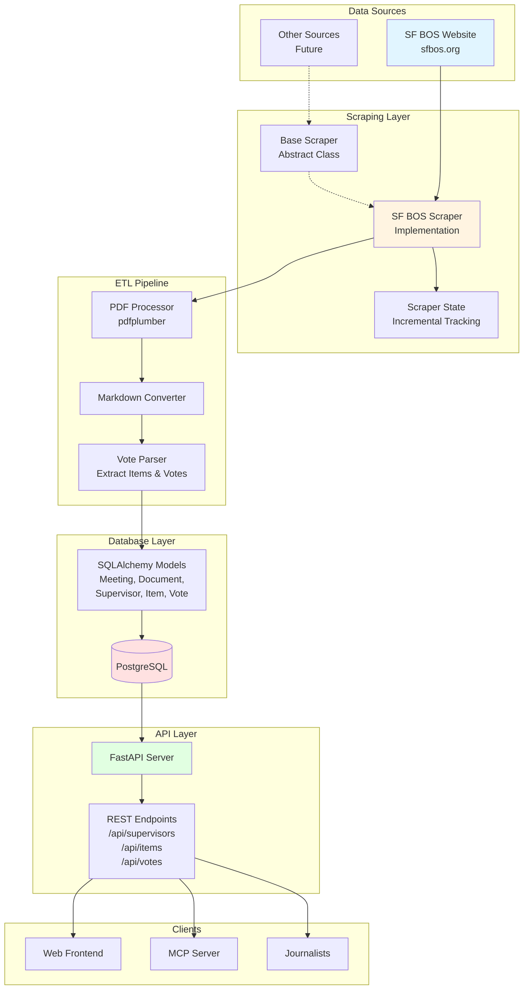
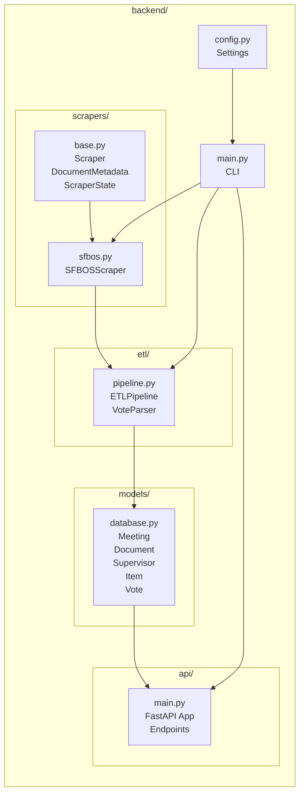
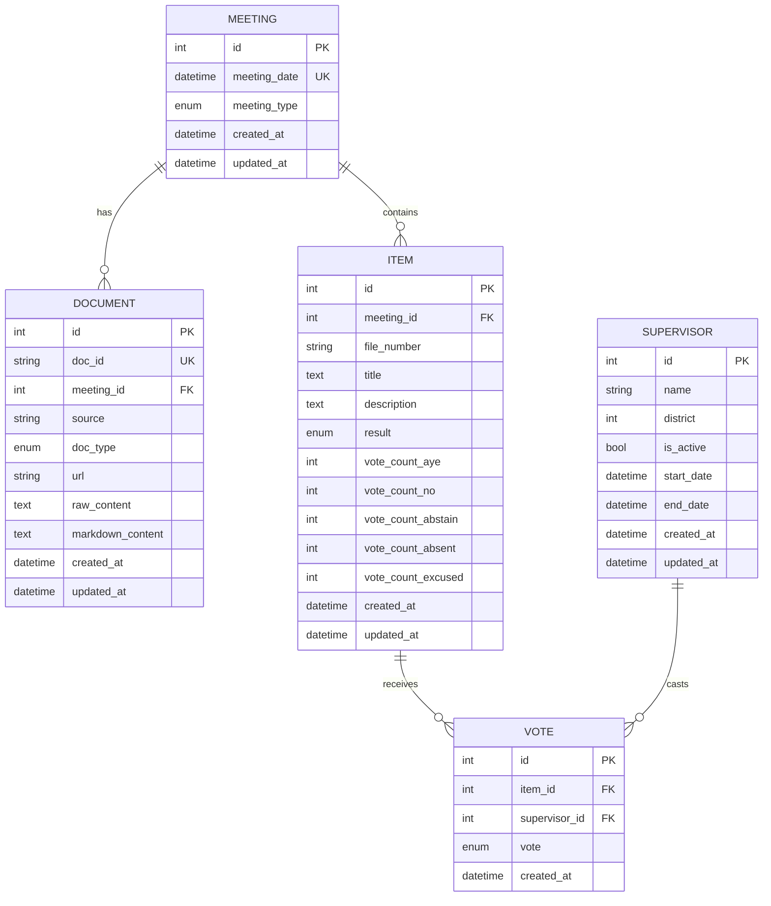
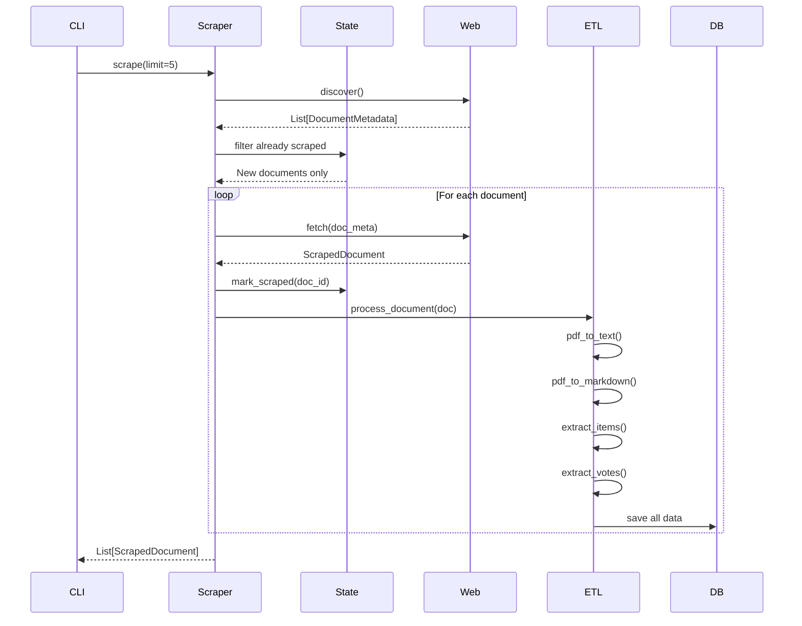
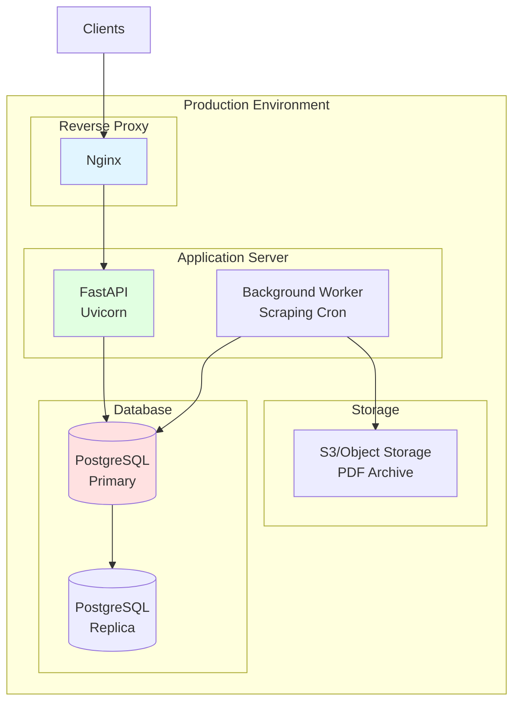

# System Architecture Diagram

## Data Flow



## Component Architecture



## Database Schema



## API Endpoints

```mermaid
graph TD
    API[FastAPI Server<br/>:8000]
    
    API --> SUP[/api/supervisors]
    API --> ITEMS[/api/items]
    API --> MEET[/api/meetings]
    API --> STATS[/api/stats]
    
    SUP --> SUP_LIST[GET /<br/>List all supervisors]
    SUP --> SUP_GET[GET /{id}<br/>Get supervisor details]
    SUP --> SUP_VOTES[GET /{id}/votes<br/>Get voting history]
    SUP --> SUP_STATS[GET /{id}/stats<br/>Get statistics]
    
    ITEMS --> ITEMS_LIST[GET /<br/>List items<br/>?search=query]
    ITEMS --> ITEMS_GET[GET /{id}<br/>Get item with votes]
    
    MEET --> MEET_LIST[GET /<br/>List meetings]
    
    STATS --> STATS_OVER[GET /overview<br/>System statistics]
```

## Scraping Flow



## Deployment Architecture



